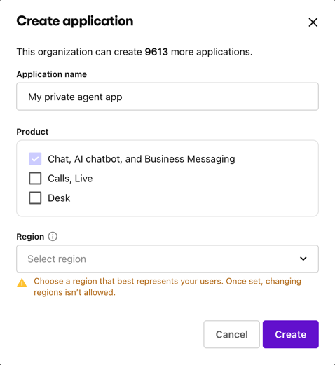
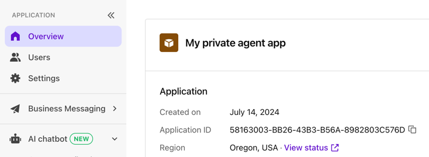
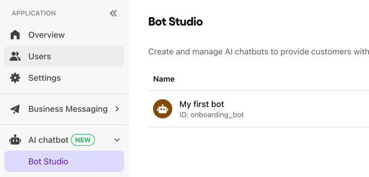
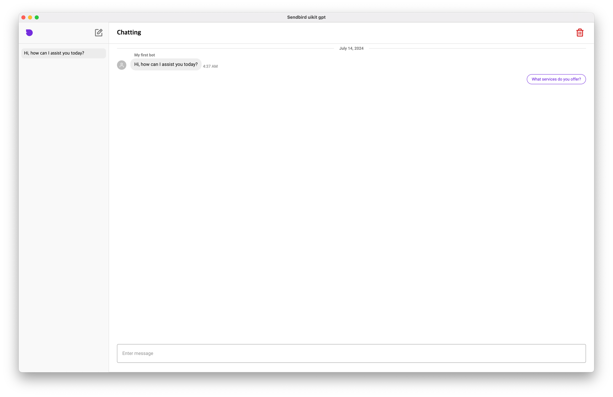
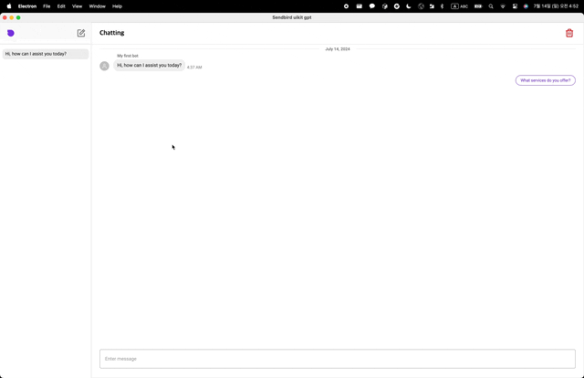

# Sendbird uikit gpt

## Requirements

- Node.js 18+
- Yarn 4+ (or corepack)

## Getting started

### Create an app and bot in the Sendbird dashboard

Create a new app and bot in the Sendbird dashboard (https://dashboard.sendbird.com/).


### Environment variables

Open the `.env` file and set the following environment variables:




```dotenv
VITE_APP_ID=your_app_id
VITE_BOT_ID=your_bot_id
```

### Install dependencies

```bash
# Install dependencies
yarn install
```

### Development

```bash
# Start the app in development mode
yarn dev
```

## Overview

- You can chat with the bot on your PC.
  

- You can easily configure the bot in the dashboard
  

---

### Built with [create-electron-vite](https://github.com/electron-vite/create-electron-vite)
